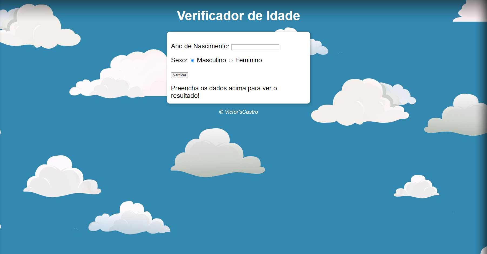

 
  
  

  ## 💻 Projeto
  Esse é um projeto WEB responsivo de de um verificador de idade a partir do ano de nascimento. Projeito feito a fim de entender conceitos básicos de JavaScript e maior aperfeiçoamento das tecnologias em questão.

  ## 🚀 Tecnologias 
  Esse projeto foi desenvolvido com as seguintes tecnologias:

  - HTML
  - CSS
  - JavaScript
  - Git e Github